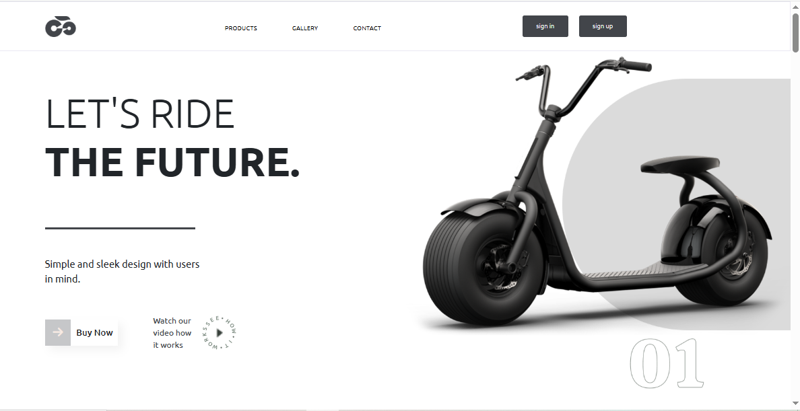

# 🛴 E-Scooter

An elegant and responsive **e-commerce website** designed for showcasing and selling **digital electronic scooters and accessories**. Built with clean 
HTML and CSS, this static website lays the foundation for a dynamic online store. Future improvements include the integration of JavaScript libraries 
like **React** for interactivity and state management.

---

## 🔗 Links

- **Live Site:** [E-Scooter Website](https://robimankhinstart.github.io/Project-3-E-Scooter/)
- **Source Code:** [GitHub Repository](https://github.com/RobiMankhinStart/Project-3-E-Scooter.git)

## 📸 Screenshot



---

## 🧰 Tech Stack

- **HTML5**
- **CSS3**
- *(Planned): JavaScript, React*

---

## ✨ Features

- Clean and modern user interface
- Responsive layout for all screen sizes
- Home page with product showcase
- Accessories section
- Navigation bar and footer
- Placeholder sections for future cart and interactivity

---

## 🚀 Getting Started

    To run this project locally:

1. **Clone the repository**

   ```bash
   git clone https://github.com/RobiMankhinStart/Project-3-E-Scooter.git

---

📦 Future Plans
    - Add JavaScript for dynamic interactions (e.g. cart functionality, filtering)

    - Transition to React for component-based structure

    - Add a backend for product management and user authentication

    - Payment gateway integration

🐞 Known Issues
    - Currently a static website – no dynamic features implemented yet

    - No real product cart or checkout system
